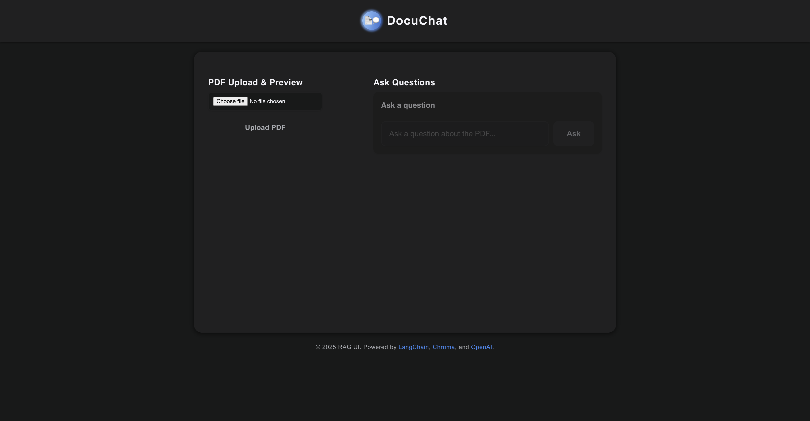
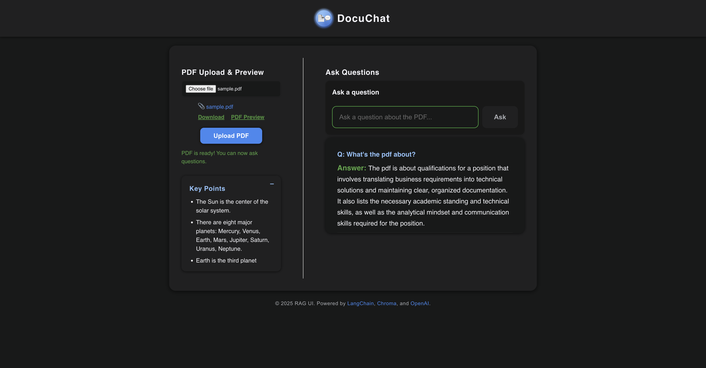
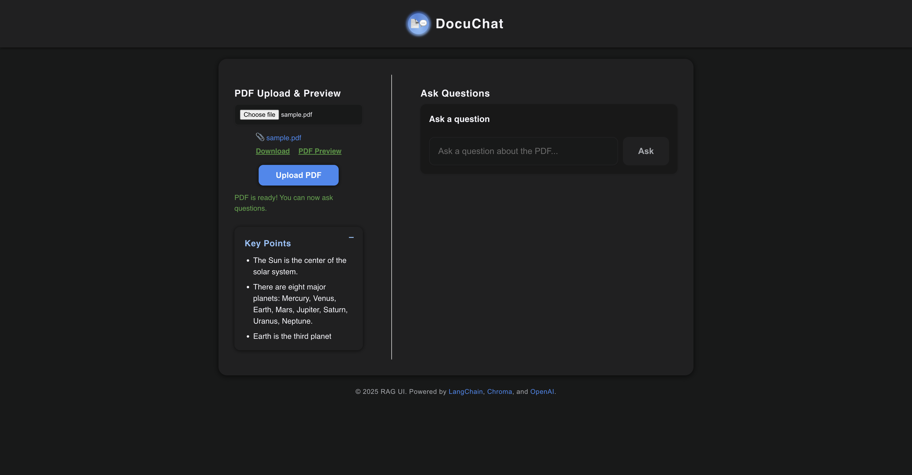

# DocuChat: Chat with Your PDFs using RAG, LangChain, and OpenAI

## Overview
DocuChat is a modern Retrieval-Augmented Generation (RAG) web app that lets you upload a PDF, ask questions about its content, and get instant answers powered by OpenAI and LangChain. It also extracts and displays key points from your PDF using an LLM summary. The app features a clean, professional React frontend and a FastAPI backend.

---

## Why LangChain?

LangChain is a powerful framework for building applications with large language models (LLMs) and retrieval-augmented generation (RAG). In this project, LangChain is used to:
- **Split and embed PDF text:** The PDF is split into manageable chunks and embedded using OpenAI embeddings.
- **Store and search embeddings:** ChromaDB is used as a vector database to store and retrieve relevant chunks based on user questions.
- **Orchestrate RAG pipeline:** LangChain connects the retriever (ChromaDB) and the LLM (OpenAI) to answer questions using both the PDF content and the LLM's reasoning.
- **Enable flexible, production-grade RAG:** LangChain makes it easy to swap out LLMs, retrievers, and add advanced features in the future.

---

## How the App Works (Functionality)

1. **PDF Upload:**
   - User uploads a PDF via the React frontend.
   - The backend saves the PDF and extracts its text.
2. **Processing & Embedding:**
   - The backend splits the PDF text into chunks and generates embeddings using OpenAI.
   - ChromaDB stores these embeddings for fast similarity search.
3. **Key Points Extraction:**
   - The backend uses OpenAI's LLM to summarize the PDF as bullet points, shown in a minimizable panel.
4. **Question Answering:**
   - User asks a question about the PDF.
   - The backend retrieves the most relevant chunks from ChromaDB and uses OpenAI (via LangChain) to generate an answer.
   - The answer and question are displayed in the UI, and all Q&A pairs are scrollable.
5. **Download/Preview:**
   - User can download or preview the uploaded PDF at any time.

This architecture ensures answers are grounded in the PDF content, while leveraging the power of LLMs for reasoning and summarization.

---

## Features
- **PDF Upload:** Upload any PDF and process it for Q&A.
- **Ask Questions:** Type questions about your PDF and get accurate answers using RAG (LangChain + ChromaDB + OpenAI).
- **Key Points Extraction:** After upload, see a minimizable panel with important bullet points from your PDF (LLM summary).
- **Q&A History:** Scrollable panel showing all your previous questions and answers.
- **Modern UI:** Responsive, minimal, and professional React interface.

---

## Prerequisites
- Python 3.11+
- Node.js 18+
- OpenAI API key (for embeddings and LLM)

---

## Backend Setup (FastAPI)
1. **Install dependencies:**
   ```bash
   cd backend
   python3.11 -m venv venv311
   source venv311/bin/activate
   pip install -r requirements.txt
   ```
2. **Set your OpenAI API key:**
   - Create a `.env` file in the `backend/` directory:
     ```env
     OPENAI_API_KEY=sk-...
     ```
3. **Run the backend server:**
   ```bash
   uvicorn main:app --reload
   ```
   - The backend will be available at `http://127.0.0.1:8000`

---

## Frontend Setup (React)
1. **Install dependencies:**
   ```bash
   cd frontend
   npm install
   ```
2. **Run the frontend:**
   ```bash
   npm start
   ```
   - The frontend will be available at `http://localhost:3000`

---

## Usage
1. **Open the app in your browser:**
   - Go to `http://localhost:3000`
2. **Upload a PDF:**
   - Click the upload area and select a PDF file.
   - The PDF will be processed automatically.
3. **See Key Points:**
   - After processing, a minimizable panel below the upload area will show important bullet points extracted from your PDF.
4. **Ask Questions:**
   - Type a question about your PDF and click "Ask".
   - The answer will appear below, along with your question. All Q&A pairs are scrollable.
5. **Download/Preview:**
   - Download or preview the uploaded PDF using the provided links.

---

## What to Expect
- **Fast, accurate answers** to questions about your PDF, using OpenAI and vector search.
- **Key points** from your PDF, summarized as bullet points by an LLM.
- **Modern, minimal UI** with a professional look and feel.
- **No location or time tracking**; only PDF content is processed.

---

## Project Structure
- `backend/` — FastAPI app, LangChain, ChromaDB, PDF processing, OpenAI integration
- `frontend/` — React app, modern UI, API calls, Q&A, key points panel

---

## Troubleshooting
- **OpenAI errors:** Ensure your API key is valid and you have quota.
- **PDF not uploading:** Check backend logs for errors.
- **CORS issues:** Both servers must run on localhost for development.

---

## Screenshots

> Add your screenshots to the `screenshots/` directory and update the paths below as needed.

### Home / Upload Page


### Q&A Example


### Key Points Panel
